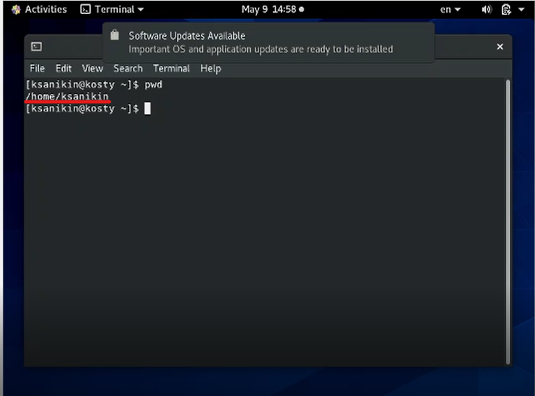
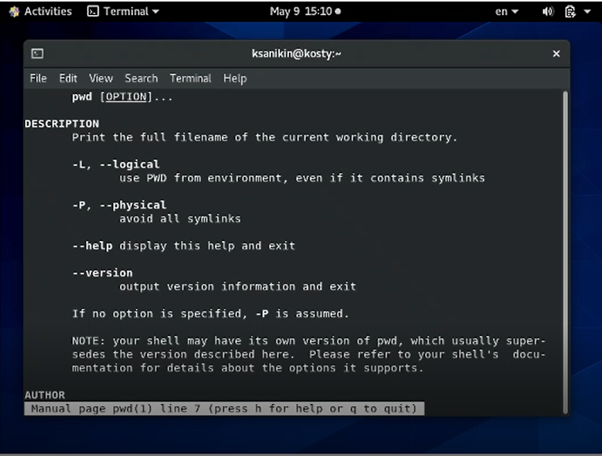

---
# Front matter
lang: ru-RU
title: "Отчет по лабораторной работе 5"
subtitle: "Операционные системы"
author: "Аникин Константин Сергеевич"
group: "НПИбд-01-20"

# Formatting
fontsize: 12pt
linestretch: 1.5
papersize: a4paper
---

# Цель работы

Приобретение практических навыков взаимодействия пользователя с системой
посредством командной строки.

# Задание

Проследовав плану выполнения работы, ознакомиться с основными командами работы в терминале.

# Выполнение лабораторной работы

Описываются проведённые действия, в качестве иллюстрации даётся ссылка на иллюстрацию

1: Определяю имя домашнего каталога (рис. 1)

*Рис. 1: Определение имени домашнего каталога*

2.1: Перешел в tmp, показал содержимое без аргументов... (рис. 2.1)

*Рис. 2.1: Содержимое tmp без аргументов*

2.2.2: ...С аргументом a... (рис. 2.2)

*Рис. 2.2: Содержимое tmp с аргументом a*

2.2.3: ...С аргументом F (рис. 2.3)

*Рис. 2.3: Содержимое tmp с аргументом F*

2.2.4: ... И с аргументом l (рис. 2.4)

*Рис. 2.4: Содержимое tmp с аргументом l*

2.3-2.4: cron есть в var/spoon, владелец файлов - я, ksanikin (рис. 2.5)

*Рис. 2.5: cron и ksanikin*

3.1-3.3: Создаю newdir и /morefun, создаю и удаляю три папки сразу (рис. 3.1)

*Рис. 3.1: Работа с mkdir и rmdir*

3.4-3.5: Удаляю каталоги newdir и morefun, rm с newdir не работает (рис. 3.2)

*Рис. 3.2: Работа с mkdir и rmdir*

4: С помощью mana нашел аргумент для выведения подкаталогов - R (рис. 4)

 

*Рис. 4: Выведение подкаталогов*

5: С помощью mana нашел аргумент для сортировки по времени - t
Аргумент для выведения описания файлов - l
Полный аргумент - lt (рис. 5)

*Рис. 5: man ls*

6cd: -L следует по ссылкам на файлы
-P не следует
-eP выдает ошибку, если cd не может сменить папку (рис. 6.1)

*Рис. 6.1: man cd*

6pwd: -L указывает каталог с учетом ссылок
-P без учета (рис. 6.2)

*Рис. 6.2: man pwd*

6mkdir: -m указывает права доступа папки
-p создаст родительские папки в структуре папок при их отсутствии
-v выведет сообщение о каждой созданной папке
-Z ставит контекст безопасности папок по умолчанию, что бы это ни значило (рис. 6.3)

 

*Рис. 6.3: man mkdir*

6rmdir: -p удаляет каталог вместе с файлами
-v выведет сообщение о каждой удаленной папке
-i при удалении каждой будет выведен запрос на подтверждение (рис. 6.4)

*Рис. 6.4: man rmdir*

6rm: -f не выводит ошибку при удалении несуществующих файлов
-i при удалении каждого будет выведен запрос на подтверждение
-d аналог rmdir
-v выведет сообщение о каждой удаленном удаленном файле (рис. 6.5)

*Рис. 6.5: man rm*
7: Воспользовался history, 
запустил программу из истории с измененным параметром (рис. 7)

*Рис. 7: Работа с history*

# Выводы

Работа была проделана полностью, никаких внезапных ошибок встречено не было. Всегда бы так.
