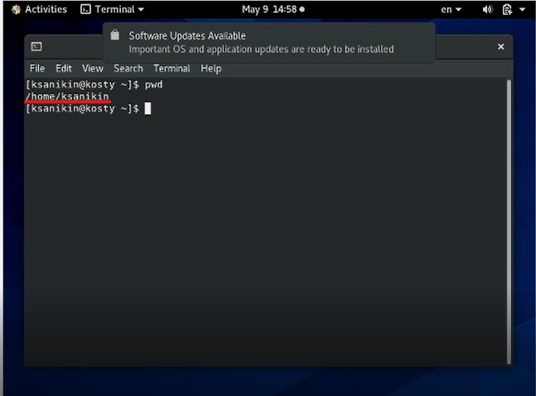
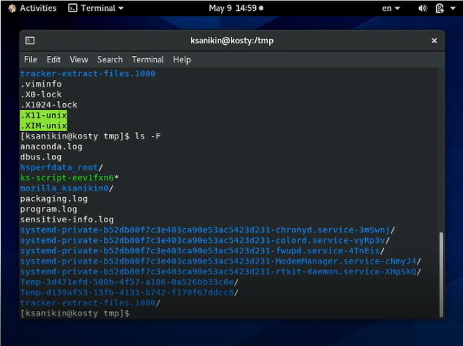
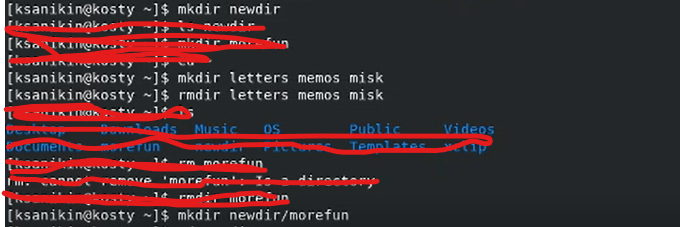
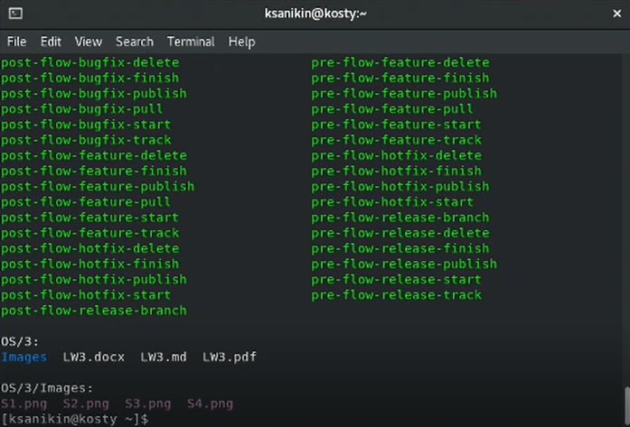
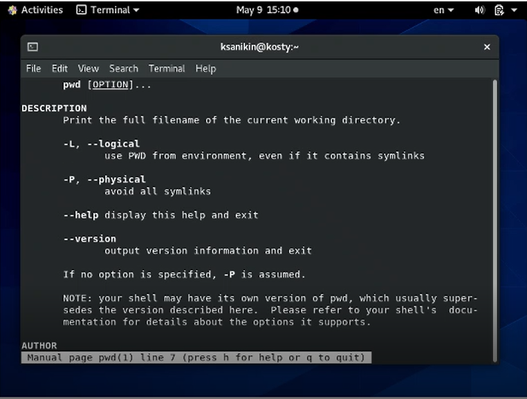
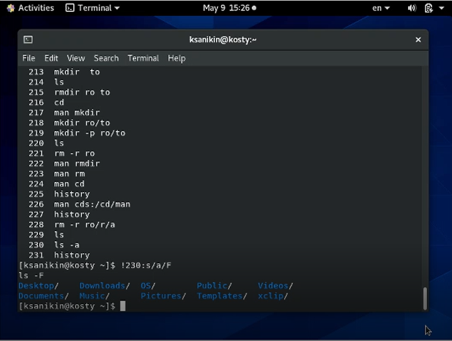

---
## Front matter
lang: ru-RU
title: Презентация лабораторной работы 5
sub-title: Операционные системы
author: Аникин Константин Сергеевич
group: НПИбд-01-20
---

# Взаимодействие с Unix-ом в командной строке

## Цель работы

- Ознакомиться с командами работы в терминале unixa

- Выполнить задание из файла

## Задачи

Научиться пользоваться командами:

- cd

- ls

- man

- mkdir

- rmdir
 
- и другие

## Результаты 1

## Результаты 2

## Результаты 3

## Вывод

- В кои-то веки, все получилось и прошло штатно. Не верится
